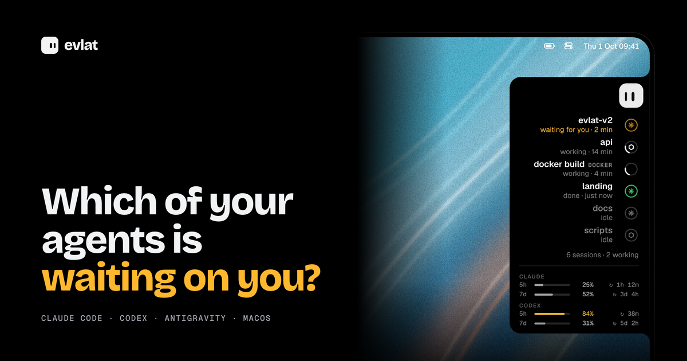
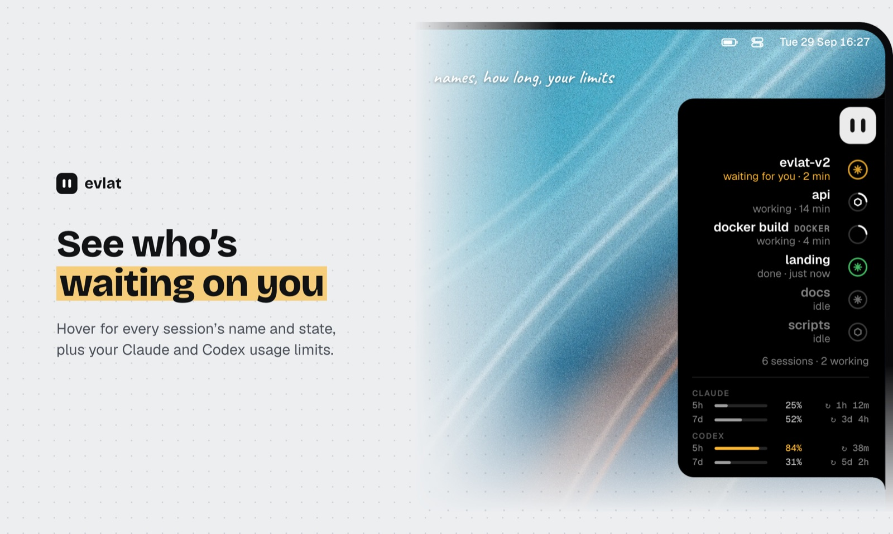
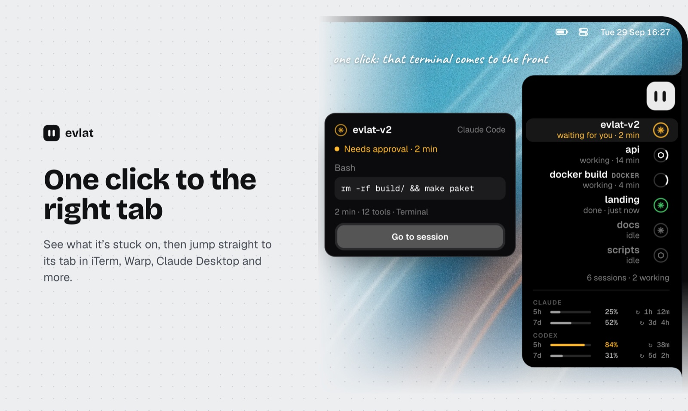
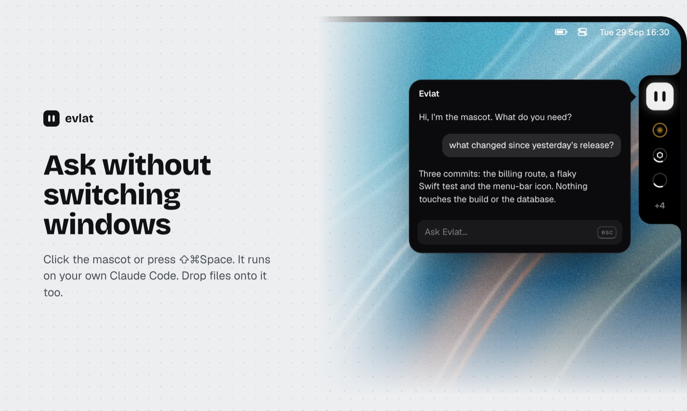

<div align="center">



# Evlat

**A status strip for the edge of your macOS screen that tells you, at a glance,
what your AI coding sessions are doing.**

[](https://github.com/evlat/evlat/releases/latest/download/Evlat.dmg)

macOS 14 or later · signed and notarized · updates itself · no macOS permissions

<table>
<tr>
<td width="33%"></td>
<td width="33%"></td>
<td width="33%"></td>
</tr>
<tr>
<td align="center">See who's waiting on you</td>
<td align="center">One click to the right tab</td>
<td align="center">Ask without switching windows</td>
</tr>
</table>

</div>

A small mascot sits at the head of the bar and shows the overall state; below
it, one ring per session. You don't have to look at the bar: when a session
stops and waits for you (a permission prompt, a question), the mascot and that
ring turn amber. Hover over the bar to see every session by name, and rest on
one to see what it is doing and jump to its terminal.

## What it shows

- **Claude Code and Codex sessions**: working, waiting for you, finished,
  failed, idle. Session state comes from hooks; running Claude Code sessions
  are also found without any setup.
- **Usage windows**: Claude's 5-hour and 7-day limits (relayed from the status
  line) and Codex's (read from its local logs).
- **Any long command**: `evlat watch npm run build` puts the command on the
  bar until it ends, and passes its output and exit code through unchanged.
- **Remote machines**: sessions and commands on servers you reach over SSH,
  through a reverse tunnel, labelled with the machine's name.
- **Chat**: click the mascot (or press ⇧⌘Space) to run a task with your own
  `claude` or `codex` CLI (Settings → Chat). Answer permission prompts in the bubble, drop files onto the
  mascot, and come back to it from the bar.

Evlat asks for no macOS permissions. Its local API listens only on loopback.

## Requirements

- macOS 14 or later
- Swift 5.9+ (Xcode or the Command Line Tools)
- Optional: [Claude Code](https://docs.claude.com/en/docs/claude-code) and/or
  Codex CLI; the chat bubble needs `claude` or `codex` on your `PATH`

## Install

Download [**Evlat.dmg**](https://github.com/evlat/evlat/releases/latest/download/Evlat.dmg),
open it and drag Evlat into Applications. It is signed and notarized, and
updates itself (**Check for Updates…** in its menu; it also checks daily).

## Build from source

```sh
git clone https://github.com/evlat/evlat.git && cd evlat
make install     # builds build/Evlat.app, copies it to /Applications, opens it
```

On first launch a short setup window walks you through the bar's edge, the
session hooks, chat and optional extras. Everything it installs can also be
changed later in **Settings** (⌘,), and every button that writes a file shows
which file it writes and offers a copy-paste alternative.

> **Signing.** A build from source is ad-hoc signed and has no updater: it
> runs on the machine that built it and never replaces itself. Releases are
> made with `make ship VERSION=x.y.z` (Developer ID, notarized, Sparkle).

Other targets:

| command | what it does |
|---|---|
| `make build` | debug build |
| `make test` | run the test suite |
| `make all` | build + test |
| `make bundle` | build `build/Evlat.app` (release) |
| `make run` | bundle and open `build/Evlat.app` |
| `make install` | bundle, copy to `/Applications`, open |
| `make clean` | remove build products |

## Command line

Settings → Command line links `~/.local/bin/evlat` to the app's binary.

```sh
evlat watch <command…>                           # show a command on the bar while it runs
evlat signal render --progress 0.4 --label Render  # drive a row yourself
evlat signal render --done
evlat --help
```

Any program can also post to the local API directly: `POST /signal` on
`127.0.0.1:48151`, with the key from
`~/Library/Application Support/Evlat/signal-48151.token` in an `X-Evlat-Key`
header. See [`AGENTS.md`](AGENTS.md) → Local API for the body.

On a remote machine, Settings → Remote machines installs a small POSIX `sh`
version of `evlat watch` / `evlat signal` that reports through the tunnel.

## Languages

English and Turkish; Evlat follows the system language.

## Contributing

Read [`AGENTS.md`](AGENTS.md) before changing code. It holds the architecture's
reasons, the contracts installed on users' machines that must not change, how
to verify a change, and a list of pitfalls that have already been hit.

Contributions are accepted under the
[Contributor License Agreement](CLA.md). You keep the copyright to your work;
the agreement lets the project license it under the terms in
[License](#license), and under other terms (for example, a commercial license).
On your first pull request a bot asks you to accept it by commenting
`I have read the CLA Document and I hereby sign the CLA`.

## License

[Functional Source License 1.1, Apache 2.0 Future License](LICENSE.md)
(FSL-1.1-ALv2).

- **You may** use Evlat for any non-competing purpose, including inside your
  company, and read, modify and share the code.
- **You may not** offer it, or a product built from it, as a commercial product
  or service that competes with Evlat.
- **Each version becomes Apache 2.0** two years after its release.

For a license outside these terms, open an issue.
