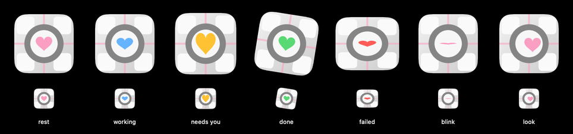

# Companion

An example look pack: a weighted cube with a heart for a face. The heart
takes the sessions' status colour (pink at rest, blue working, yellow when a
session needs you, green done, red failed), squeezes on a blink, swells while
waiting and follows the gaze. With the `glados` OpenPeon character installed
(Settings → Mascot → Who speaks? → More characters…), choosing this look makes
it the voice; no audio is part of this pack.

**Credit.** Inspired by the Weighted Companion Cube from *Portal* (Valve). An
original drawing, not Valve's artwork; not affiliated with or endorsed by
Valve. Made by Gabe Perez (@gabeperez). License: fan art, personal
non-commercial use.

## Use it

Settings → Mascot → Appearance → **Import Look…**, then choose this folder
(or a `.zip` of it). It appears in the Look picker as *Companion*.

## Files

- `character.json` — the manifest (see `CharacterPack` for the format)
- `body.png` — the cube, 512×512, transparent around the edges
- `heart.png` — the face mask, tinted by status (`"tint": "status"`)
- `preview.png` — every state, large and at the bar's size (not part of the pack)

